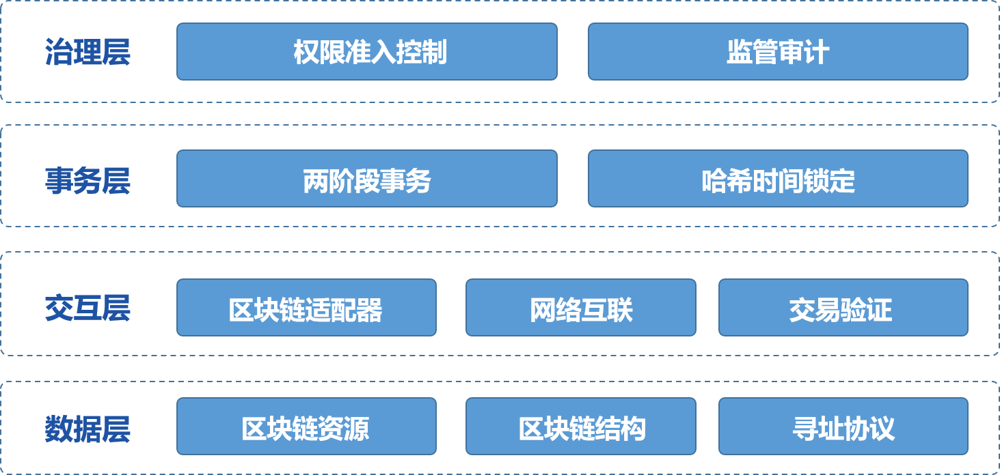
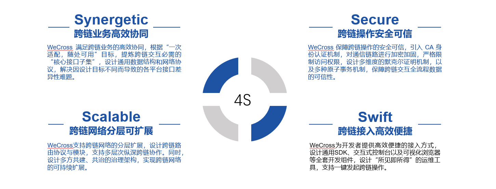

**WeCross**是由微众银行自主研发并完全开源的区块链跨链协作平台，致力于促进跨行业、机构和地域的跨区块链信任传递和商业合作。WeCross不局限于满足同构区块链平行扩展后的可信数据交换需求，还进一步探索解决异构区块链之间因底层架构、数据结构、接口协议、安全机制等多维异构性导致无法互联互通问题的有效方案。

   
  

## WeCross整体架构设计

- **数据层**：跨链交互的核心是数据在链间的流动，数据层的抽象就尤为重要。跨链涉及的数据维度包括区块、交易、合约、消息等多个方面。WeCross以满足跨链基本要求为前提，提炼通用区块数据结构，将交易、合约和消息等抽象设计成资源类型，为资源设计通用的寻址协议。

- **交互层**：不同业务场景有不同的跨链交互模型，基于抽象数据层，WeCross建设通用区块链适配与路由中继网络，结合标准默克尔证明机制，实现跨链交互层抽象设计。

- **事务层**：基于数据结构和交互的抽象层，实现跨链事务效果。目前支持两类机制：两阶段事务和哈希时间锁定事务。未来将依据场景需求设计更多事务机制。

## WeCross四大技术

- **通用区块链接口**：本着“求同存异”、“聚焦最大公约数”的基本思路，通用区块链接口（UBI）对交易、智能合约与资产等数据进行抽象包装，设计统一的资源范式，设计普适跨链场景的抽象区块数据结构，为异构区块链的交互建立数据协议一致的基础，实现“一次适配，随处可用”的效果。 

- **异构链互联模型**： 尽管各家区块链平台的内部架构、网络模型和共识逻辑有很大差异，但这些区块链平台的对外接口存在共性。异构链互联模型（HIP）通过分析主流区块链平台交互方式的共性点，提炼一种通用的区块链接入范式与跨链交互模型。 

- **可信事务机制**：区块链内部的安全机制在面对跨区块链调度时会突破安全边界，无法实现可信与事务。可信事务机制（TTM）提出数据互信机制和跨链事务机制，解决区块链可信问题和交易事务性的问题。 

- **多边跨域治理**：多边跨域治理（MIG）是一套完整的区块链多边治理方案，支持多个区块链按照其业务需求，以不同的网络拓扑来组建跨链分区。

## 快速开始

阅读[快速入门](https://wecross.readthedocs.io/zh_CN/dev/docs/tutorial/index.html)，从连通两个区块链开始，快速体验WeCross的强大功能。

## 技术文档

阅读[WeCross 在线文档](https://wecross.readthedocs.io/zh_CN/latest/)，详细了解如何使用WeCross。

- [平台介绍](https://wecross.readthedocs.io/zh_CN/latest/docs/introduction/introduction.html)
- [程序版本](https://wecross.readthedocs.io/zh_CN/latest/docs/version/index.html)
- [快速入门](https://wecross.readthedocs.io/zh_CN/latest/docs/tutorial/index.html)
- [操作手册](https://wecross.readthedocs.io/zh_CN/latest/docs/manual/index.html)
- [跨链接入](https://wecross.readthedocs.io/zh_CN/latest/docs/stubs/index.html)
- [应用场景](https://wecross.readthedocs.io/zh_CN/latest/docs/scenarios/index.html)
- [FAQ](https://wecross.readthedocs.io/zh_CN/latest/docs/faq/faq.html)
- [社区](https://wecross.readthedocs.io/zh_CN/latest/docs/community/community.html)

## 项目贡献

- 点亮我们的小星星(点击项目左上方Star按钮)。
- 提交代码(Pull requests)，参考我们的[代码贡献流程](CONTRIBUTING_CN.md)。
- [提问和提交BUG](https://github.com/WeBankFinTech/WeCross/issues)。

## 社区

联系我们：wecross@webank.com

