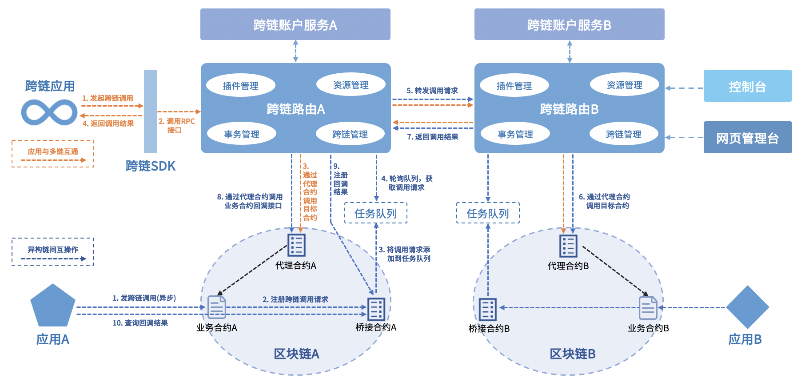

  
  

## WeCross简介

WeCross是由微众银行自主研发并完全开源的区块链跨链协作平台，致力于促进跨行业、机构和地域的跨区块链信任传递和商业合作。WeCross支持应用与多链互操作、同/异构链间互操作等多维跨链交互，实现了:

- **一站式跨链管理**

    WeCross为方便开发、维护和管理跨链应用，配套多种跨链工具，包括命令行[终端控制台](https://github.com/WeBankBlockchain/WeCross-Console)和**可视化**[网页管理平台](https://github.com/WeBankBlockchain/WeCross-WebApp)。

- **插件式跨链接入**

    WeCross只需基于[Stub接口](https://wecross.readthedocs.io/zh_CN/latest/docs/dev/stub.html)针对不同的链开发适配器，就能以插件化的方式实现跨链接入。目前适配的区块链包括[FISCO BCOS 2.0](https://github.com/WeBankFinTech/WeCross-BCOS-Stub)、[Hyperledger Fabric 1.4](https://github.com/WeBankBlockchain/WeCross-Fabric1-Stub) 和 [Hyperledger Fabric 2](https://github.com/WeBankBlockchain/WeCross-Fabric2-Stub)。

- **统一跨链身份**

    WeCross基于[跨链账户服务](https://github.com/WeBankBlockchain/WeCross-Account-Manager)管理账户的生命周期。每个跨链账户对应多个链账户，实现跨链身份的统一。

- **统一资源范式**

    WeCross对各个链的资源包括合约、交易以及区块等进行抽象和封装，并基于通用跨链接口和统一的寻址方式实现对不同资源的访问和调用。

- **跨链事务保障**

    WeCross基于[两阶段提交](https://wecross.readthedocs.io/zh_CN/latest/docs/routine/xa.html)实现多链的事务写操作。回滚时，事务中的操作都会被重置，最终恢复到事务前的状态。

- **资产原子交换**

    WeCross基于[哈希时间锁合约](https://wecross.readthedocs.io/zh_CN/latest/docs/routine/htlc.html)实现异构链间资产原子交换，无需更改原链上的资产模型和资产合约，通用性较强。

- **合约跨链调用**

    WeCross不仅支持跨链应用对异构多链发起调用，而且还支持由合约发起的对其它链合约的异步[跨链调用](https://wecross.readthedocs.io/zh_CN/latest/docs/dev/interchain.html)。

了解更多技术特性，请下载阅读[WeCross白皮书](https://mp.weixin.qq.com/s/w0APEAonFXbOoinMJipPAA)。

## WeCross架构

## 快速开始

阅读[快速入门](https://wecross.readthedocs.io/zh_CN/latest/docs/tutorial/demo/index.html)，从连通两个区块链开始，快速体验WeCross的强大功能。

## 技术文档

阅读[WeCross 在线文档](https://wecross.readthedocs.io/zh_CN/latest/)，详细了解如何使用WeCross。

- [平台介绍](https://wecross.readthedocs.io/zh_CN/latest/docs/introduction/introduction.html)
- [程序版本](https://wecross.readthedocs.io/zh_CN/latest/docs/version/index.html)
- [快速入门](https://wecross.readthedocs.io/zh_CN/latest/docs/tutorial/index.html)
- [跨链接入](https://wecross.readthedocs.io/zh_CN/latest/docs/stubs/index.html)
- [跨链事务](https://wecross.readthedocs.io/zh_CN/latest/docs/routine/index.html)
- [操作手册](https://wecross.readthedocs.io/zh_CN/latest/docs/manual/webApp.html)
- [开发手册](https://wecross.readthedocs.io/zh_CN/latest/docs/dev/sdkindex.html)
- [应用场景](https://wecross.readthedocs.io/zh_CN/latest/docs/scenarios/index.html)
- [FAQ](https://wecross.readthedocs.io/zh_CN/latest/docs/faq/faq.html)
- [社区](https://wecross.readthedocs.io/zh_CN/latest/docs/community/community.html)

## 项目贡献

欢迎参与WeCross社区的维护和建设：

- 提交代码(Pull requests)，可参考[代码贡献流程](CONTRIBUTING.md)以及[wiki指南](https://github.com/WeBankBlockchain/WeCross/wiki/%E8%B4%A1%E7%8C%AE%E4%BB%A3%E7%A0%81)
- [提问和提交BUG](https://github.com/WeBankBlockchain/WeCross/issues/new)

您将成为贡献者，感谢各位贡献者的付出：

## 开源社区

参与meetup：[活动日历](https://github.com/WeBankBlockchain/WeCross/wiki#%E6%B4%BB%E5%8A%A8%E6%97%A5%E5%8E%86)

学习知识、讨论方案、开发新特性：[联系微信小助手，加入跨链兴趣小组（CC-SIG）](https://wecross.readthedocs.io/zh_CN/latest/docs/community/cc-sig.html#id3)

## License

WeCross的开源协议为Apache License 2.0，详情参考[LICENSE](./LICENSE)。
